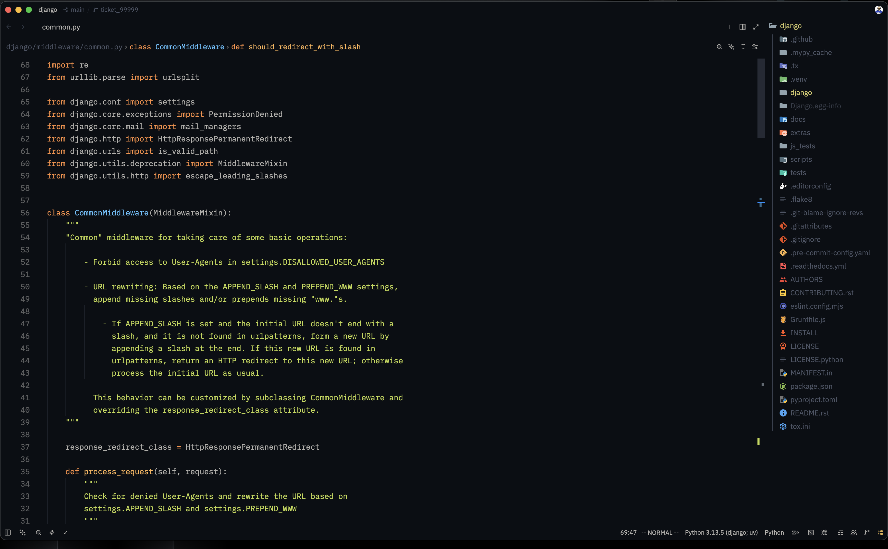

# pustota.zed

A clean, minimalist zed theme inspired by the original [pustota VSCode theme](https://github.com/sobolevn/pustota). Designed to keep you focused on working in the editor without visual distractions.

--------------------------------------------------------------------------------


## Features
- Distraction-free, minimalist aesthetic
- Consistent and calm color palette
- Closely matches the original VSCode Color theme

## Installation
1. Clone the repository:
   ```bash
   git clone https://github.com/pustota-theme/pustota.zed.git
   ```
2. Navigate to the cloned directory:
   ```bash
   cd pustota.zed
   ```
3. Copy the theme file to your Zed themes directory:
    ```bash
    mkdir -p ~/.config/zed/themes
    cp themes/pustota.json ~/.config/zed/themes/
    ```
4. Activating the Theme

- Open Zed.
- Open the Command Palette:

   * **Linux/Windows:** `Ctrl+Shift+P`
   * **macOS:** `Cmd+Shift+P`
- Search for and select **Theme Selector: Toggle**.
- Choose **`pustota`** from the list of available themes.

Alternatively, you can navigate to **Preferences → Appearance → Theme** and select **`pustota`**.

The theme will be applied immediately.

--------------------------------------------------------------------------------
Feel free to open an issue or pull request if you notice any missing highlights or inconsistencies. Happy coding!
